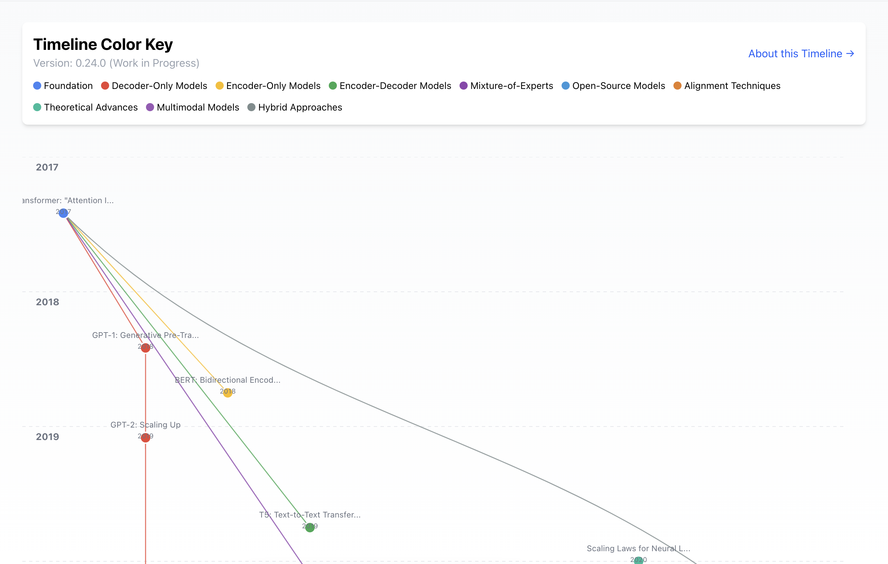

# LLM Timeline

An interactive visualization of the evolution of Large Language Models from the Transformer architecture in 2017 to the present day.



## Overview

LLM Timeline is a web application that visually maps the development history of large language models, showing how different architectures, approaches, and innovations have built upon one another. The project aims to make the complex landscape of LLMs more accessible to researchers, developers, and AI enthusiasts.

### Features

- Interactive SVG-based timeline visualization
- Color-coded branches representing different model architectures and approaches
- Detailed node information showing each model's innovations and impact
- Connection visualization showing how models build upon previous research
- Links to original papers and resources
- Responsive design for various screen sizes

## Live Demo

Visit [https://llmtimeline.web.app](https://llmtimeline.web.app) to see the live project.

## Tech Stack

- **Framework**: Next.js with TypeScript
- **Styling**: Tailwind CSS
- **Visualization**: SVG and React components
- **Data**: Static TypeScript files (timelineData.ts)

## Installation

### Prerequisites

- Node.js (v18 or newer)
- npm or yarn

### Setup

1. Clone the repository:
   ```bash
   git clone https://michaelgathara.com/git/llm-timeline.git
   cd llm-timeline
   ```

2. Install dependencies:
   ```bash
   npm install
   # or
   yarn install
   ```

3. Run the development server:
   ```bash
   npm run dev
   # or
   yarn dev
   ```

4. Open [http://localhost:3000](http://localhost:3000) in your browser to see the application.

## Project Structure

```
llm-timeline/
├── components/
│   ├── Timeline.tsx           # Main timeline visualization component
│   └── TimelineVisualization.tsx # Alternative interactive visualization
├── data/
│   └── timelineData.ts        # Timeline data and branches definitions
├── pages/
│   ├── index.tsx              # Home page
│   ├── _app.tsx               # Next.js application wrapper
│   ├── _document.tsx          # Custom document component
│   └── about.tsx              # About page
├── styles/
│   └── globals.css            # Global styles and Tailwind imports
├── public/                    # Static assets
└── README.md                  # Project documentation
```

## Data Model

The timeline is built around two main data structures:

1. `TimelineNode`: Represents a significant model or advancement in LLM history
2. `timelineBranches`: Defines the different categories and their colors

To add a new entry to the timeline, edit the `timelineData.ts` file and add a new object to the `timelineData` array.

Example node structure:
```typescript
{
  id: "unique-id",
  title: "Model Name or Paper Title",
  year: 2023,
  month: 6, // Optional
  description: "Brief description of the model or advancement",
  branch: "branch-id", // Must match an id in timelineBranches
  innovations: [
    "Innovation 1",
    "Innovation 2"
  ],
  impact: "Description of the impact", // Optional (highly recommended)
  modelSize: "Parameter count", // Optional (highly recommended)
  link: "URL to paper or resource", // Optional (highly recommended)
  parentIds: ["parent-id-1", "parent-id-2"] // Optional (highly recommended), for connections
}
```

## Contributing

Contributions are welcome! If you'd like to add models, fix data, or improve the visualization:

1. Fork the repository
2. Create a new branch for your feature (`git checkout -b feature/amazing-feature`)
3. Commit your changes (`git commit -m 'Add some amazing feature'`)
4. Push to the branch (`git push origin feature/amazing-feature`)
5. Open a Pull Request

### Adding New Models

To add a new model to the timeline:

1. Edit `data/timelineData.ts`
2. Add a new TimelineNode object to the timelineData array
3. Ensure it has the required fields and appropriate parentIds for connections
4. Test the visualization to ensure proper positioning and connections

## License

This project is licensed under the MIT License - see the LICENSE file for details.

